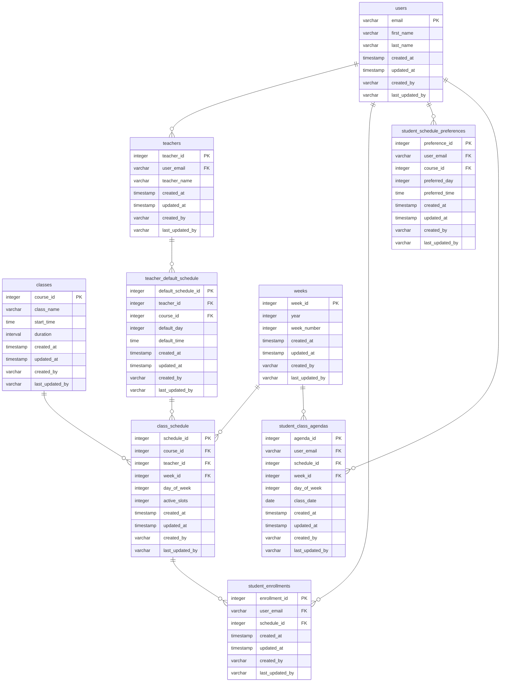

# Descrição Simplificada do Modelo de Dados

Esta descrição tem como objetivo explicar o modelo de dados da Academia de uma forma que seja fácil de entender, mesmo para aqueles sem conhecimento técnico. O modelo é projetado para gerenciar aulas, professores, alunos e agendamentos de forma eficiente.

## Visão Geral

O sistema é composto por várias 'tabelas' que armazenam diferentes tipos de informações. Cada tabela tem uma função específica, como armazenar dados sobre os usuários (alunos e professores), aulas, agendamentos e preferências. Essas tabelas estão interconectadas para formar o sistema completo da Academia.

## Tabela `users`

- **Propósito:** Armazena informações básicas sobre todos os usuários, sejam eles alunos ou professores.
- **Campos Principais:**
  - `email`: O endereço de e-mail do usuário, usado como identificação única.
  - `first_name`: O primeiro nome do usuário.
  - `last_name`: O sobrenome do usuário.
  - `created_at`: A data e hora em que o usuário foi adicionado ao sistema.
  - `updated_at`: A última data e hora em que as informações do usuário foram atualizadas.
  - `created_by`: Quem criou o registro do usuário.
  - `last_updated_by`: Quem atualizou o registro do usuário pela última vez.

### Casos de Uso para `users`

1. **Cadastro de Aluno/Professor:** Quando um novo aluno ou professor é adicionado à academia, suas informações são registradas nesta tabela.
2. **Atualização de Dados:** Se um usuário precisa atualizar seu nome ou outro detalhe, isso é refletido nesta tabela.
3. **Identificação do Usuário:** O sistema usa o e-mail para identificar e diferenciar cada usuário, seja para fazer login ou para atribuir aulas e agendamentos.

---

## Tabela `classes`

- **Propósito:** Armazena informações sobre as diferentes aulas oferecidas pela academia.
- **Campos Principais:**
  - `course_id`: Identificador único para cada aula.
  - `class_name`: Nome ou descrição da aula.
    - Exemplo: "Yoga Matinal", "Musculação Avançada".
  - `start_time`: Horário de início da aula.
    - Exemplo: "08:00", "18:30".
  - `duration`: Duração da aula.
    - Exemplo: "1 hora", "30 minutos".

### Casos de Uso para `classes`

1. **Criação de Aulas:** Cada nova aula oferecida pela academia, como "Yoga Matinal às 08:00 por 1 hora", é adicionada nesta tabela com detalhes como nome, horário e duração.
2. **Consulta de Horários:** Alunos e professores podem consultar os tipos de aulas disponíveis, como "Musculação Avançada às 18:30 por 1 hora", e seus respectivos horários.

---

## Tabela `teachers`

- **Propósito:** Armazena informações sobre os professores, que também são usuários do sistema.
- **Campos Principais:**
  - `teacher_id`: Identificador único para cada professor.
  - `user_email`: Referência ao e-mail do professor na tabela `users`.
  - `teacher_name`: Nome do professor.
    - Exemplo: "João Silva", "Maria Fernandes".

### Casos de Uso para `teachers`

1. **Associação Professor-Usuário:** Cada professor, como "João Silva" ou "Maria Fernandes", é vinculado ao seu perfil de usuário, permitindo que ele acesse o sistema tanto como professor quanto como aluno.
2. **Gerenciamento de Professores:** A academia pode gerenciar informações sobre seus professores, como "João Silva disponível para aulas de Yoga Matinal" e "Maria Fernandes disponível para Musculação Avançada".

---

## Tabela `teacher_default_schedule`

- **Propósito:** Armazena a disponibilidade padrão dos professores para dar aulas.
- **Campos Principais:**
  - `default_day`: Dia padrão da semana para a disponibilidade.
    - Exemplo: "1" para Segunda-feira, "3" para Quarta-feira.
  - `default_time`: Horário padrão para a disponibilidade.
    - Exemplo: "09:00", "17:00".

### Casos de Uso para `teacher_default_schedule`

1. **Definição de Disponibilidade:** Professores estabelecem sua disponibilidade padrão, como "João disponível às 09:00 nas Segundas-feiras".
2. **Planejamento de Aulas:** A academia utiliza essas informações para planejar as aulas, garantindo que os professores estejam disponíveis nos horários estabelecidos.

---

## Tabela `weeks`

- **Propósito:** Representa as semanas de cada ano.
- **Campos Principais:**
  - `year`: Ano.
    - Exemplo: "2024", "2025".
  - `week_number`: Número da semana no ano.
    - Exemplo: "1" para a primeira semana, "52" para a última semana.

### Casos de Uso para `weeks`

1. **Organização Temporal:** Facilita a organização e o planejamento das aulas em uma base semanal, como "Aula de Yoga na primeira semana de 2024".

---

## Tabela `class_schedule`

- **Propósito:** Armazena o agendamento das aulas, incluindo o professor e a semana em que ocorrerão.
- **Campos Principais:**
  - `day_of_week`: Dia da semana em que a aula ocorrerá.
    - Exemplo: "1" para Segunda-feira, "5" para Sexta-feira.
  - `active_slots`: Número atual de vagas disponíveis.
    - Exemplo: "10" vagas, "15" vagas.

### Casos de Uso para `class_schedule`

1. **Agendamento de Aulas:** Define quando cada aula ocorrerá, como "Musculação Avançada às Segundas-feiras na semana 5 de 2024".
2. **Gestão de Capacidade:** Gerencia o número de vagas disponíveis para cada aula, ajustando-se conforme a demanda e a disponibilidade do professor.

---

## Tabela `student_enrollments`

- **Propósito:** Armazena as inscrições dos alunos em aulas específicas.
- **Campos Principais:**
  - `timestamp created_at`: Data e hora da inscrição.
    - Exemplo: "2024-01-05 08:00:00".
  - `timestamp updated_at`: Data e hora da última atualização da inscrição.
    - Exemplo: "2024-01-10 09:00:00".

### Casos de Uso para `student_enrollments`

1. **Inscrição em Aulas:** Alunos se inscrevem em aulas, como "Maria inscreve-se para Yoga Matinal na primeira semana de 2024".
2. **Gerenciamento de Participação:** Acompanha quais alunos estão inscritos em quais aulas, permitindo ajustes e cancelamentos conforme necessário.

---

## Tabela `student_schedule_preferences`

- **Propósito:** Armazena as preferências dos alunos quanto a dias e horários para aulas.
- **Campos Principais:**
  - `preferred_day`: Dia preferido da semana para aulas.
    - Exemplo: "2" para Terça-feira, "4" para Quinta-feira.
  - `preferred_time`: Horário preferido para as aulas.
    - Exemplo: "18:00", "20:00".

### Casos de Uso para `student_schedule_preferences`

1. **Configuração de Preferências:** Alunos definem suas preferências de agendamento, como "João prefere aulas às 18:00 nas Terças e Quintas".
2. **Personalização de Agendas:** O sistema utiliza essas informações para ajudar a criar agendas personalizadas para os alunos.

---

## Tabela `student_class_agendas`

- **Propósito:** Armazena as agendas das aulas para os alunos, baseadas em suas preferências e disponibilidade das aulas.
- **Campos Principais:**
  - `class_date`: Data da aula agendada.
    - Exemplo: "2024-03-15", "2025-01-07".
  - `timestamp created_at`: Data e hora da criação da agenda.
    - Exemplo: "2024-01-01 10:00:00".
  - `timestamp updated_at`: Data e hora da última atualização da agenda.
    - Exemplo: "2024-01-02 11:00:00".

### Casos de Uso para `student_class_agendas`

1. **Criação de Agendas Semanais:** Baseado nas preferências dos alunos, o sistema gera agendas semanais, como "Agenda de Maria para a segunda semana de Março de 2024".
2. **Ajustes e Atualizações:** Permite ajustes nas agendas conforme mudanças nas disponibilidades ou preferências dos alunos.

# Visualização do Modelo de Dados

